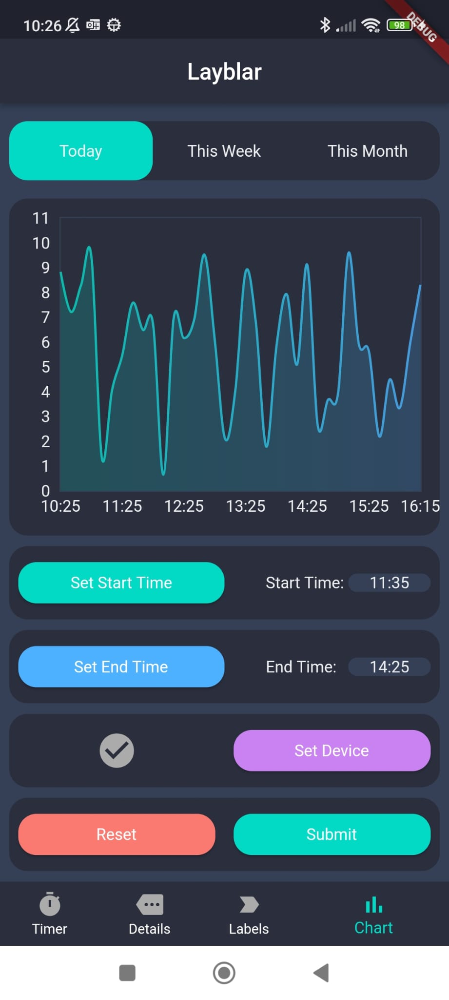
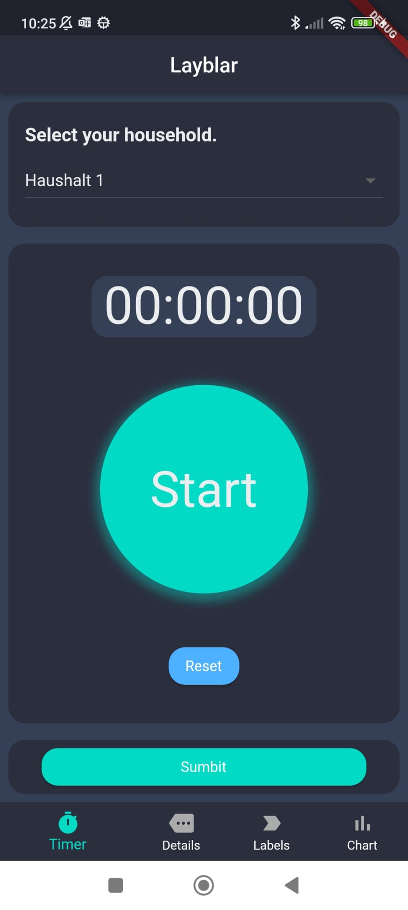
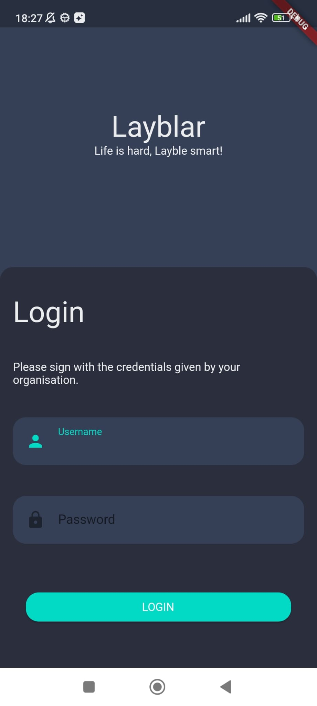
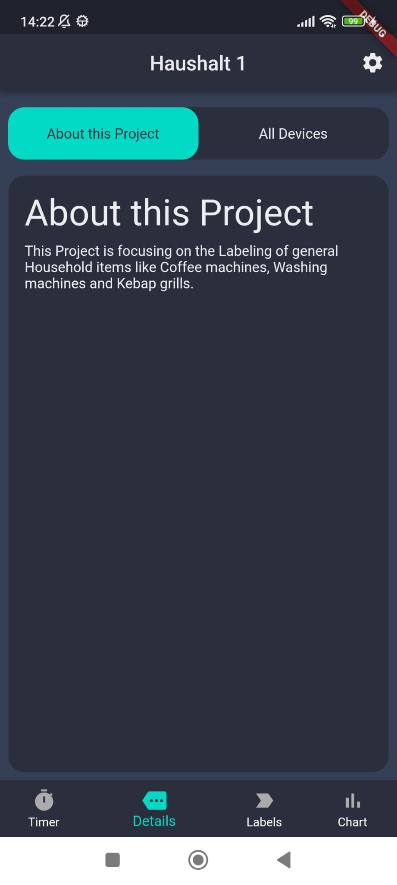
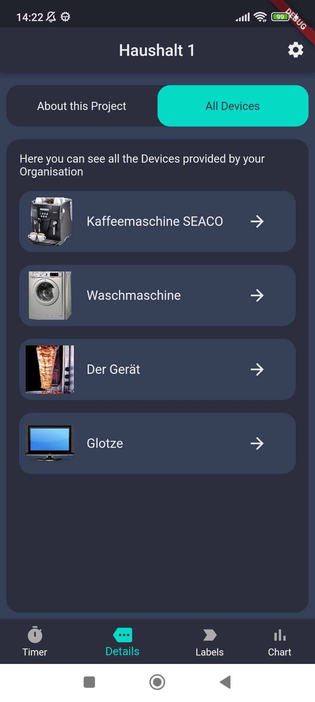
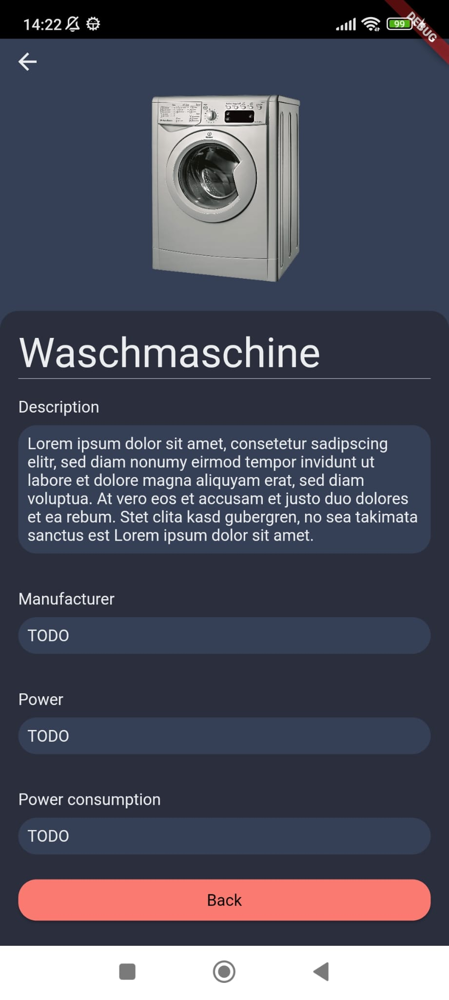

# Changelog

All notable changes to this project will be documented in this file.

## 2023-10-30 - ([Richard Lorenz](https://github.com/fluttervieh))

### Added
- First layout/structure of the Application
- implementation of the chart screen
- implementation of the stopwatch screen

## 2023-10-30 - ([Richard Lorenz](https://github.com/fluttervieh))

### Added
- Graph view: ALtrnative Inforbox when the feature time range is not enabled

## 2023-11-05 - ([Richard Lorenz](https://github.com/fluttervieh))

### Added
- Settings page to change households and logout in future
- finshed first prototype of ui for chart and timer view
- first draft for the labels screen

## 2023-11-06 - ([Richard Lorenz](https://github.com/fluttervieh))

### Added
- Plain UI for the login-screen
- Login navigation logic

## 2023-11-07 - ([Richard Lorenz](https://github.com/fluttervieh))

### Added
- Plain UI for the details apge
- switch between about and devices list
- Details Page with mostly plain data for each device

## 2023-11-16 - ([Richard Lorenz](https://github.com/fluttervieh))

### Updated
- Chart selection View according to Coach's feedback
- added a slider for the dynamic chart time selection

## 2023-11-17 - ([Richard Lorenz](https://github.com/fluttervieh))

### Updated
-  Timer view: added feature of having multiple Stopwatches running simultaneously.

## 2023-11-20 - ([Richard Lorenz](https://github.com/fluttervieh))

### Updated
- Timer View: fixed some bugs with the state preseveration fof the individual stopwatch items

- Timer View: added first scetch of the timer section, including a prototype of a time picker and a timer with pase and resume

